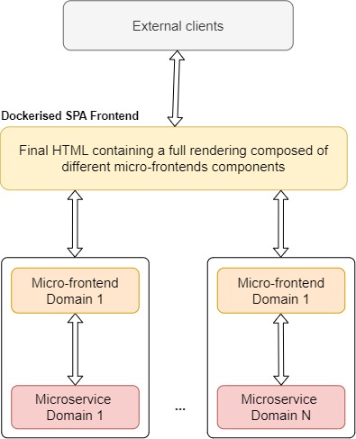
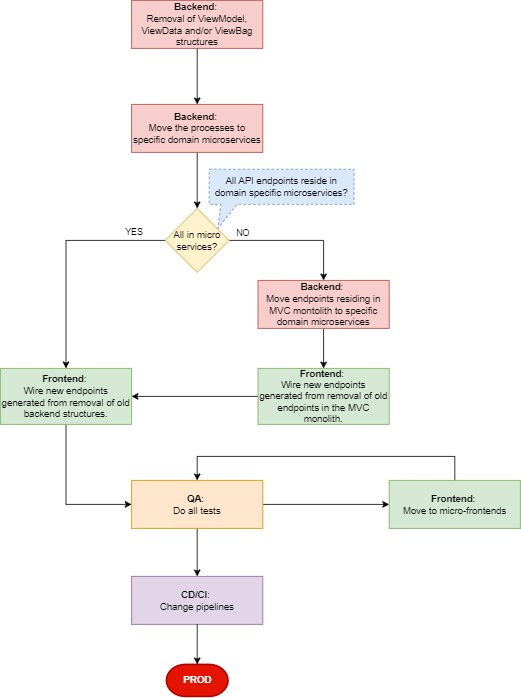

# Several solutions for the transformation of an MVC monolith
Here we provide a few ADRs, based on several assumptions, after further analysis of the generic challenge description.

## The challenge: ARCHITECTURE MIGRATION:
- *"You must provide solutions for the transformation of an MVC monolith that includes several
domains into bounded context microservices architecture and SPA Frontend."*
- *"Our expectation is that you could provide several solutions with your assumptions, pros and cons
and a high-level delivery approach and steps."*

## Assumptions, strategies and migration paths proposals:

> Our <ins>***First Base Assumption***</ins> is that the monolith application/project is a web *.Net ASP.Net MVC* application, where we use a modern framework as *Vue*, *Angular* or *React* to achieve a *SPA* functionality. 

This means that the backend side of this application will serve as either:  

1. A mere connection proxy to the bounded microservices 

	or 

2. A mix of proxy logic with the bounded microservices, and some endpoints with internal logic residing in the monolith.

In both cases the backend could be using specific *MVC* data and operations such as *ViewBag*, *ViewModel* and/or *ViewData* structures, to interact with the Views, all this to finally bring info into the html results. Changing all this is an essential part of the following migration process.

> [!IMPORTANT] 
>
> **Global Pros**
> - Removing all the backend side of the *MVC* app will allow to speed up the loading process.
> - Clients will have a smoother navigation experience when browsing the website.
> - Faster maintenance process.
> - **The frontend could be divided into smaller domain bounded micro-frontends, each one using it´s corresponding domain microservices, allowing more specialisation in the tribes/teams**.
> - Backend developers will only focus their work in the domain microservices.

> [!CAUTION]  
>
> **Global Cons**
> - Depending on the size and complexity of the *MVC* backend, this enterprise could be time-consuming and somehow tedious.
> - Will require a mix of resources with different backgrounds, from backend devs with frontend knowledge and frontend devs specialised in the front framwork to be used.
> - Will require a big testing work, in order to obtain the same functionality as before.
> - Will probably need a full-stop in developing new features in the "old" *MVC* code, otherwise there´s a high risk of not including them in the new migration.

> Our <ins>***Second Base Assumption***</ins> is that we will migrate the frontend applicaton into a full web application using one or many modern frontend frameworks such as *Vue*, *Angular* and/or *React*.

This second base assumption removes the posibility of going into the *Blazor* path, as this one will lead us into a completely different scenaio.

## Desired result after the architecture migration with a global SPA dockerised/containerised website

## Desired result after the architecture migration with the SPA website divided into dockerised/containerised micro-frontends

## In order to achieve the above result, we can divide the migration solutions in two iterations:

1. Backend:

	a. [`Assumption 1: Removal of Views and Conrtrollers use of ViewModel, ViewData and/or ViewBag structures. Move the processes to specific domain microservices.`](ADRs/assumption1.md)
	
	***IF*** **Some API endpoints reside in domain specific microservices and others reside in the MVC monolith** ***THEN*** 

	b. [`Assumption 2`](ADRs/assumption2.md)

2. Frontend:

	***IF*** **All API endpoints reside in domain specific microservices** ***THEN*** 

	a. [`Assumption 3`](ADRs/assumption3.md)
	
	***ELSE***
 
	b. [`Assumption 4: Some API endpoints reside in domain specific microservices and others reside in the MVC monolith.`](ADRs/assumption4.md)

## Full workflow
 