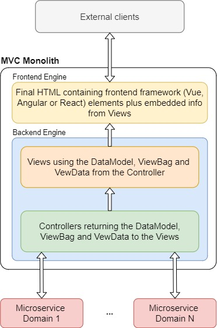
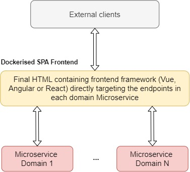

# Several solutions for the transformation of an MVC monolith
Here we provide a few ADRs, based on several assumptions, after further analysis of the generic challenge description.

## The challenge: ARCHITECTURE MIGRATION:
- *"You must provide solutions for the transformation of an MVC monolith that includes several
domains into bounded context microservices architecture and SPA Frontend."*
- *"Our expectation is that you could provide several solutions with your assumptions, pros and cons
and a high-level delivery approach and steps."*

## Assumptions, strategies and migration paths proposals:

Our base assumption is that the monolith application/project is a web *.Net ASP.Net MVC* application, where we use a modern framework as *Vue*, *Angular* or *React* to achieve a *SPA* functionality. 

This means that the backend side of this application will serve as either:  

1. A mere connection proxy to the bounded microservices 

	or 

2. A mix of proxy logic with the bounded microservices, and some endpoints with internal logic residing in the monolith.

In both cases the backend could be using specific *MVC* data and operations such as *ViewBag*, *ViewModel* and/or *ViewData* structures, to interact with the Views and finally to bring info into he html results. Changing all this is an essential part of the following migration process.

> [!IMPORTANT] 
>
> **Global Pros**\
> this is

> [!CAUTION]  
>
> **Global Cons**\
> this is

## Desired result after the architecture migration

### In order to achieve the above result, we can divide the migration solutions in two iterations:

1. Backend:

	***IF*** **All API endpoints reside in domain specific microservices** ***THEN*** 

	a. [`Assumption 1: Removal of Views and Conrtrollers use of ViewModel, ViewData and/or ViewBag structures. Move the processes to specific domain microservices.`](ADRs/assumption1.md)
	
	***ELSE***

	b. [`Assumption 2: Some API endpoints reside in domain specific microservices and others reside in the MVC monolith.`](ADRs/assumption2.md)

2. Frontend:

	***IF*** **All API endpoints reside in domain specific microservices** ***THEN*** 

	a. [`Assumption 3`](ADRs/assumption3.md)
	
	***ELSE***
 
	b. [`Assumption 4: Some API endpoints reside in domain specific microservices and others reside in the MVC monolith.`](ADRs/assumption4.md)